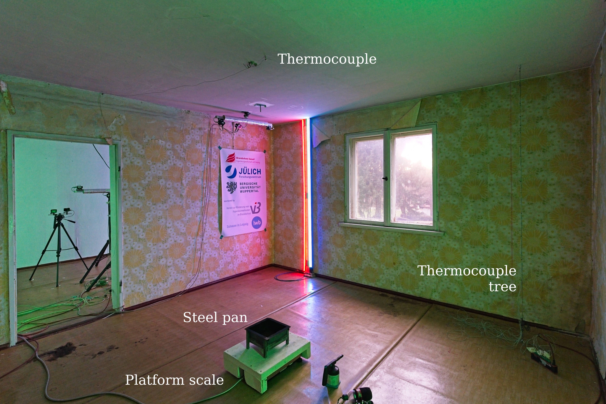
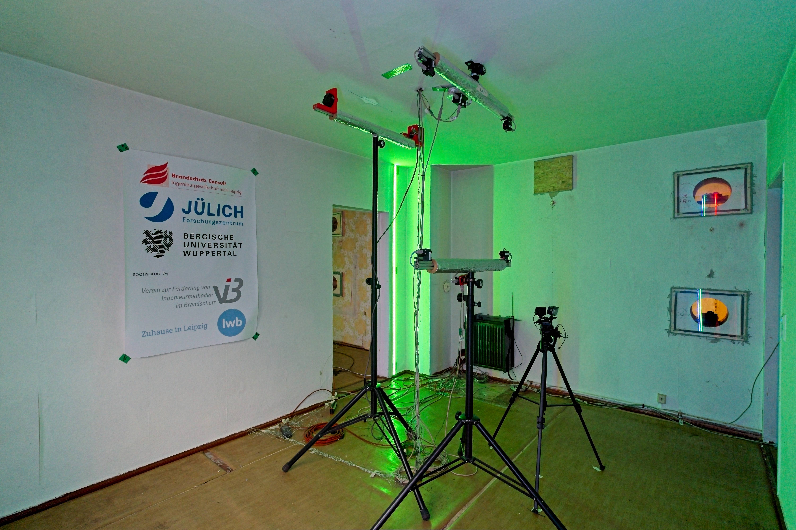
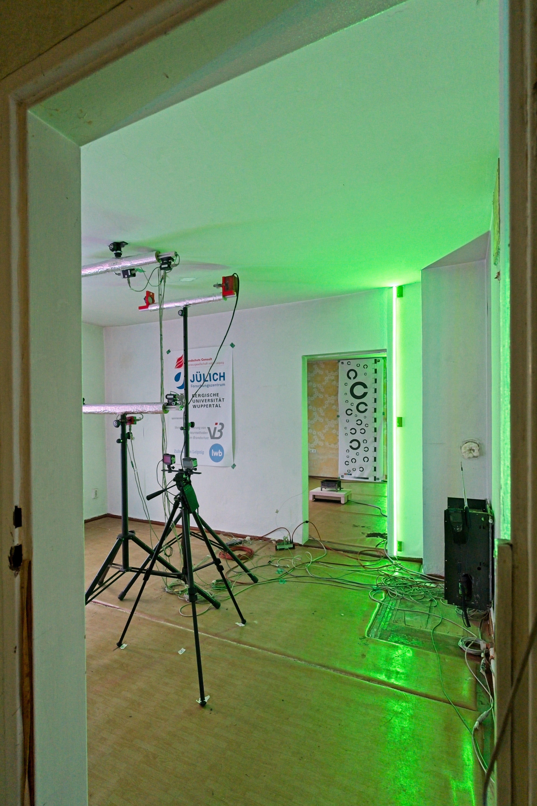
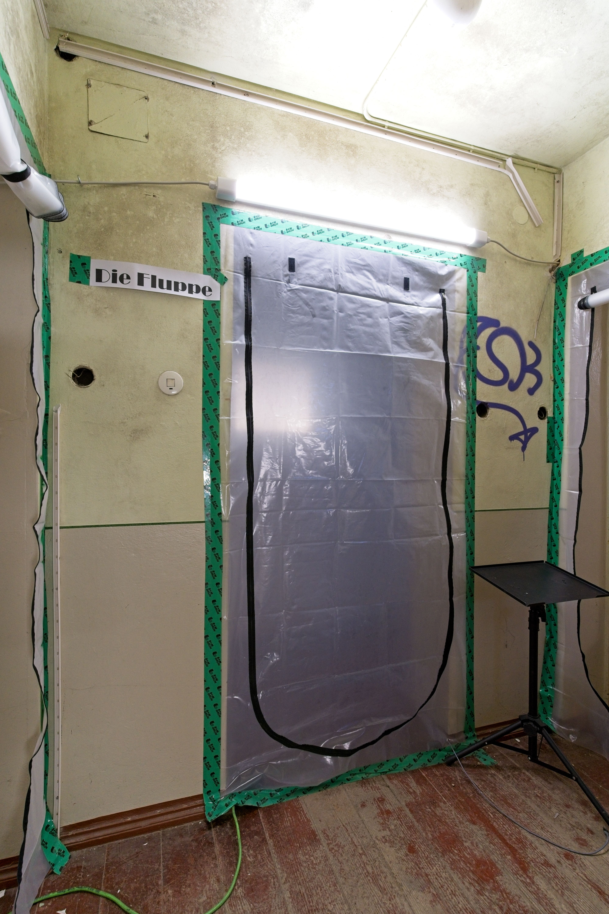
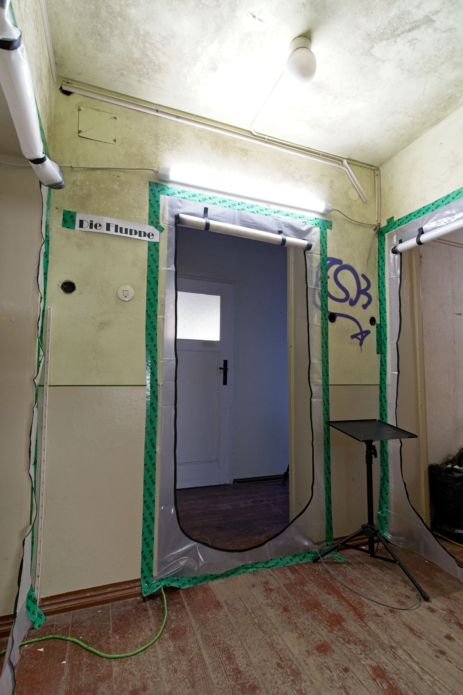

# VIB Hasenheide FDS Round-Robin Study

## Stage 1: Semi-Blind Prediction Exercise

**Scenario:** `hep_160_150`  
**Exercise type:** Semi-blind prediction  
**Simulation code:** Fire Dynamics Simulator (FDS) 6.11.0  
**Status:** Preparation / Call for Participation  
**Organiser:** Verein zur Förderung von Ingenieurmethoden im Brandschutz e. V. (VIB)  
**License:** CC BY 4.0 (see [LICENSE](LICENSE))

---

## 1. Purpose and scope

This FDS round-robin study investigates the variability of numerical predictions for a full-scale compartment fire experiment. The focus is on smoke transport, thermal stratification, optical extinction, smoke alarm actuation and the resulting tenability assessment.

The purpose is not to rank individual participants. The study addresses the following question:

> How large is the variability of FDS predictions for smoke transport, thermal conditions, optical extinction, smoke alarm actuation and tenability in a full-scale compartment fire when all participants use the same experimental setup, geometry, measurement locations, FDS version, template and fuel mass history, but make their own justified engineering modelling choices?

Stage 1 is conducted as a **semi-blind prediction exercise**:

- **blind**, because measured gas temperatures, optical extinction data and smoke alarm actuation times are not disclosed before submission;
- **specified**, because the scenario description, geometry, boundary conditions, FDS version, FDS template, measurement locations and fuel mass history are provided;
- **open with respect to modelling assumptions**, because participants define and justify key modelling choices such as mesh resolution, fire source specification, soot yield, radiative fraction, leakage assumptions and wall boundary conditions.

A later **open calculation** stage is planned. In that stage, experimental data will be disclosed and participants may revise their models, perform sensitivity analyses and investigate the causes of deviations.

By prescribing the fuel mass history, the exercise deliberately removes fire-growth prediction from its scope and focuses on smoke transport, thermal stratification, optical extinction, smoke alarm actuation and tenability. This is a conscious design choice to isolate these quantities from the well-known large uncertainty of fire-growth modelling.

The findings characterise the prediction variability for this specific scenario and participant sample. They are not intended as a general measure of FDS reliability; broader conclusions require the additional scenarios and participants planned for later stages.

---

## 2. Scenario and provided data

Stage 1 uses the experimental setup `hep_160_150` — a series of three replicate liquid pool fire tests conducted in a vacant residential building. The fire was located in room F1 of the test apartment “Fluppe”. The full scenario description is in [`scenario/scenario_description.md`](scenario/scenario_description.md).

**At a glance**

| Item | Value |
|---|---|
| Scenario ID | `hep_160_150` |
| Fire compartment | F1 |
| Fuel | Commercial “heptane”, C7-UVCB hydrocarbon mixture (n-/iso-/cyclic alkanes) |
| Pan | 160 mm × 160 mm × 100 mm, 150 g initial fuel mass |
| Replicate tests | 3 |
| Evaluation period | Pre-ventilation period |
| Quantities of interest | Gas temperature, optical extinction (638 nm), smoke alarm actuation (DIN EN 14604), tenability |
| FDS version | FDS 6.11.0 |

The apartment layout consists of three interconnected rooms and a corridor:

- **F1:** fire compartment,
- **F2:** adjacent room,
- **F3:** further adjacent room,
- **FC:** corridor.

Internal doors between these areas were removed. Windows remained closed during the pre-ventilation period. The entrance to the stairwell was separated by a closed plastic foil door.







| Plastic-sheet door, closed | Plastic-sheet door, open |
|---|---|
|  |  |

**Provided uniformly to all participants:**

- Scenario description — [`scenario/scenario_description.md`](scenario/scenario_description.md) (test sequence, fuel composition, ambient conditions, instrumentation, measurement heights and locations).
- Geometry — floor plan, sections and DXF drawings in [`geometry/`](geometry/) ([floor plan PDF](geometry/Floor_plan_overview.pdf)).
- FDS template with the reference geometry and all measurement locations as `DEVC` — [`fds/`](fds/).
- Averaged and smoothed fuel mass history — [`scenario/mass_loss_hep_160_150.csv`](scenario/mass_loss_hep_160_150.csv).

This information defines a common baseline; detailed values are given in the scenario description and the FDS template.

---

## 3. Modelling choices left to the participants

The following modelling choices are intentionally left to the participants. They must be documented and justified in the questionnaire.

The choice of surrogate fuel and combustion parameters is itself treated as part of the modelling variability under investigation; the sources of these values are recorded in the questionnaire so that their contribution to the overall scatter can be analysed separately.

| Category | Modelling choice |
|---|---|
| Computational mesh | Cell sizes, mesh layout, domain decomposition and parallelisation |
| Fire source specification | Implementation of the provided fuel mass history, HRR derivation, MLRPUA, RAMP functions. The provided fuel mass curve has been smoothed; participants should verify that the MLRPUA or HRRPUA derived by numerical differentiation is also sufficiently smooth and apply additional smoothing if necessary. |
| Fuel / reaction model | Participant-defined C7 surrogate or user-defined reaction |
| Soot yield | `SOOT_YIELD` |
| CO yield | `CO_YIELD` |
| Radiative fraction | `RADIATIVE_FRACTION` |
| Wall boundary conditions | Inert, thermally active or simplified layered constructions |
| Leakage / infiltration | None, estimated or parameterised |
| Initial conditions | Where not explicitly specified in the data package |
| Numerical settings | As long as they are plausible for FDS 6.11.0 and documented |
| Tenability assessment | Criteria for impaired egress and incapacitation |
| Sensitivity analyses | Optional, in addition to the main prediction |

Each submission must contain one clearly identified **best-estimate prediction**. Additional sensitivity cases are welcome but will be evaluated separately.

The best-estimate prediction should be as realistic as possible. This is a prediction exercise, not an engineering design: participants should not apply safety factors, deliberately conservative assumptions or worst-case choices. The aim is to forecast the actual fire behaviour as accurately as possible.

---

## 4. FDS template

The provided FDS template is the common technical basis for Stage 1. It contains:

- the reference geometry,
- room and coordinate definitions,
- thermocouple locations as `DEVC`,
- optical measurement locations as `DEVC`,
- smoke alarm locations as `DEVC`,
- placeholders for the fire source, material properties, mesh and other modelling choices.

The template is intended to ensure that all participants use the same measurement and evaluation locations. The geometry may be adapted or refined if this is technically justified and documented in the questionnaire. Fire source specification, mesh, material properties and smoke-related parameters remain part of the free modelling choices.

---

## 5. Data not disclosed before submission

The following information is not provided before the submission freeze:

- measured gas temperature time series,
- measured optical extinction time series,
- smoke alarm actuation times,
- results from other participants.

The provided fuel mass history is an averaged and smoothed curve derived from three replicate tests. Its implementation in FDS, for example as a prescribed heat release rate or as a mass loss rate, must be documented by the participants.

When the experimental data are released, the evaluation will quantify the experimental repeatability (replicate scatter) and report it as a reference band, so that the spread of the simulation results can be interpreted relative to the experimental uncertainty rather than against a single curve.

---

## 6. Quantities of interest

The following quantities are evaluated. Exact heights, locations and the reference wavelength are defined in [`scenario/scenario_description.md`](scenario/scenario_description.md) (§8) and in the FDS template `DEVC` entries:

- **Gas temperature** — thermocouples in F1, F2 and F3 at eight heights (0.6–2.5 m), plus a ceiling thermocouple above the pan in F1. The template uses `QUANTITY='THERMOCOUPLE'` to match the radiation-affected bead response of the measured thermocouples.
- **Optical extinction** — extinction coefficient σ [1/m] at the optical measurement locations, reference wavelength 638 nm.
- **Smoke alarm actuation** — optical smoke alarms (DIN EN 14604) at the ceiling in F2, FC and F3.
- **Tenability** — assessed by the participant in F1, F2, FC and F3.

### 6.1 Smoke alarm actuation

Participants shall state how smoke alarm actuation is represented in their simulation. Acceptable approaches include, for example, a direct FDS detector model, actuation based on a participant-defined optical density or extinction threshold, or another documented and justified quantity.

No common “correct” actuation threshold is prescribed in Stage 1. The participant's choice of activation method and threshold is part of the prediction under study: predicted activation times are compared against the experimentally measured activation times, and the variability of the chosen methods is analysed rather than removed.

### 6.2 Tenability assessment

For each of F1, F2, FC and F3, participants shall estimate when conditions relevant to impaired egress are reached and when incapacitation is expected. The assessment methodology shall be documented; possible criteria include optical extinction or visibility, gas temperature, smoke layer height, CO concentration or a combined engineering judgement.

The choice of tenability criteria and threshold values is itself an object of this study. Participants therefore define and justify their own criteria; the resulting variability in the criteria and in the predicted tenability times is part of the intended analysis and is compared against the experimental data. Participants may use additional quantities, sensor locations or derived indicators (e.g. visibility, smoke layer height, FED-related quantities, gas concentrations) provided these are documented in the questionnaire.

---

## 7. Repository structure

```text
.
├── README.md
├── README_de.md
├── LICENSE
├── CITATION.cff
├── scenario/
│   ├── scenario_description.md
│   └── mass_loss_hep_160_150.csv
├── geometry/
│   ├── Floor_plan_overview.pdf
│   ├── 25103-01_1OG.pdf
│   ├── 25103-01_S01-06.pdf
│   ├── 25103-01_1OG.dxf
│   ├── S-02.dxf … S-06.dxf
│   └── photos/
├── fds/
│   └── hep_160_150_ParticipantID_RunID.fds
└── docs/
    ├── Call_for_Participation_de.pdf
    ├── Call_for_Participation_en.pdf
    ├── submission_format.md
    ├── faq.md
    └── privacy.md
```

---

## 8. Participation workflow

### Step 1: Registration

Interested individuals, teams or organisations register by email:

```text
hasenheide@bcl-leipzig.de
```

Each independent contribution (a team or modeller working separately) receives its own anonymous participant ID, e.g. `K7M`, `3QA`, `BV5`. One participant ID corresponds to one submission, which may contain several runs (a best estimate plus optional sensitivity variants); exactly one run is marked `best_estimate`. Multiple independent contributions from the same organisation are welcome.

### Step 2: Data package

Participants use the current released version of this repository. Only official releases are binding.

### Step 3: Simulation

Each group performs at least one best-estimate simulation of `hep_160_150` using FDS 6.11.0. Optional sensitivity cases may be submitted in addition to the best-estimate prediction.

### Step 4: Questionnaire

Participants complete the structured questionnaire (see Section 9), which is available in this repository from the kick-off.

### Step 5: Submission

Package and name the submission as described in [`docs/submission_format.md`](docs/submission_format.md): a compressed archive containing the FDS input file(s), any referenced additional files, the FDS output file (`.out`) and the CSV result files, with the main prediction clearly identified as `best_estimate`.

### Step 6: Formal submission check

The evaluation team checks the submission for completeness, file structure, FDS version, presence of FDS output files and consistency of the `DEVC` outputs.

### Step 7: Submission freeze

After the submission freeze, technical corrections may be allowed if necessary and documented. Scientific or modelling changes are no longer accepted.

### Step 8: Evaluation and workshop

After the freeze, the experimental data are evaluated and compared with the anonymised simulation results. The findings are discussed in a workshop. The purpose of the workshop is joint interpretation, not ranking of participants.

---

## 9. Questionnaire

A structured questionnaire is a mandatory part of each submission. Rather than the values themselves (which are read directly from the input file), it records the **reasoning and sources** behind the open modelling choices — fuel and combustion parameters, mesh, wall boundary conditions, leakage and the smoke-alarm method — together with the tenability assessment for F1, F2, FC and F3 and some participant context. The questionnaire is provided in this repository from the kick-off.

---

## 10. Recommended optional sensitivity analyses

The following sensitivity analyses are recommended but not mandatory:

| Sensitivity | Example |
|---|---|
| Mesh | Coarse / medium / fine |
| Soot yield | Lower / higher |
| Radiative fraction | Lower / higher |
| Leakage | None / estimated |
| Wall boundary conditions | Inert / thermally active |
| Fuel mass history implementation | Alternative HRR or MLRPUA implementations |

Sensitivity analyses shall not be used to select the “best” curve after the fact. The central comparison remains the pre-defined best-estimate prediction.

---

## 11. Preliminary schedule

| Phase | Description | Date / Deadline | Status |
|---|---|---|---|
| Preparation | Repository, data package and templates | — | Completed |
| Registration opens | Start of registration | from 2026-05-10 | Open |
| Registration deadline | Last day for registration | 2026-06-30 | Open |
| Kick-off | Introduction of scenario and rules | invitation after registration deadline | Open |
| Simulation phase | Work by participants | after kick-off – 2026-09-30 | Open |
| Question deadline | Last day for technical questions | 2026-09-15 | Open |
| Submission freeze | Freeze of all submissions | 2026-09-30 | Open |
| Stage 1 evaluation | Comparison with measurement data | tba | Open |
| Workshop | Discussion of anonymised results | tba | Open |
| Open calculation | Later stage with disclosed measurement data | tba | Planned |

---

## 12. Anonymisation, publication and authorship

Submissions are initially evaluated internally by the evaluation team. In reports and presentations, participant groups are anonymised, for example as `K7M`, `3QA`, `BV5`.

If a scientific publication is prepared, active contributors may be invited as co-authors if they agree and meet the usual authorship criteria. Authorship and author order will be discussed transparently before submission.

Planned project outputs include:

- internal VIB report,
- workshop presentation,
- optional scientific publication,
- optional public benchmark data package after completion of the study.

Individual FDS files or detailed participant results will only be published after separate approval.

---

## 13. Questions and official answers

Questions shall be sent in writing to the project coordination:

```text
hasenheide@bcl-leipzig.de
```

Answers that are relevant to all participants will be published anonymously in [`docs/faq.md`](docs/faq.md). Only information documented in this repository or in an official release is binding.

---

## 14. Versioning

Participation shall be based on the official GitHub release:

```text
https://github.com/openbcl/fds-roundrobin-hasenheide
```

In case of any discrepancy between the published Call for Participation and this repository, the current official repository release is binding.

---

## 15. Contact

Project coordination:

```text
Manuel Osburg
Lukas Arnold

hasenheide@bcl-leipzig.de
```

Data protection information: [`docs/privacy.md`](docs/privacy.md).

---

## 16. Submission checklist

Before submission, please check:

- [ ] Best-estimate case is clearly identified.
- [ ] FDS 6.11.0 was used.
- [ ] FDS input file `*.fds` is included.
- [ ] FDS output file `*.out` is included.
- [ ] CSV result files `*.csv` are included.
- [ ] CSV columns correspond to the `DEVC` IDs defined in the FDS template (see [`docs/submission_format.md`](docs/submission_format.md)).
- [ ] Additional files referenced by the FDS input are included.
- [ ] Additional quantities, sensor locations or derived indicators used for the tenability assessment are documented.
- [ ] No experimental target data were used.
- [ ] Archive follows the naming convention.
- [ ] Questionnaire is completed.
- [ ] Archive is sent to `hasenheide@bcl-leipzig.de`.

---

## 17. Short summary

Stage 1 of the VIB Hasenheide FDS Round-Robin Study is a semi-blind FDS prediction exercise for the compartment fire scenario `hep_160_150`. Participants receive a common scenario description, geometry, boundary conditions, measurement locations, averaged and smoothed fuel mass history and an FDS template. Experimental gas temperatures, optical extinction data and smoke alarm actuation times remain hidden until submission. Key modelling choices such as mesh resolution, fire source specification, soot yield, radiative fraction, leakage assumptions, wall boundary conditions, smoke alarm thresholds and tenability criteria remain open and must be documented. The aim is to quantify the variability of FDS predictions and identify dominant modelling influences for smoke transport, thermal conditions, optical extinction, smoke alarm actuation and tenability assessment.
